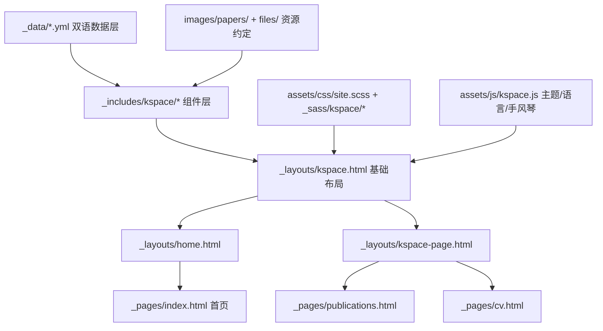

## 用户需求

彻底抛弃当前 academicpages 模板的原有视觉设计，为求职场景重新设计个人学术主页；重点重做论文展示区，按「章节」组织、可展开折叠，每篇论文除标题与简短介绍外，还要有论文示意图与 PDF 链接；整站支持中英文切换。

## 产品概述

一个面向求职（研究岗/算法岗）的深色科技感个人学术主页，包含三个页面：首页（概览）、Publications（研究成果详情）、CV。整站支持中英双语一键切换与明暗主题一键切换，切换结果被记忆。视觉上以近黑深蓝为底、青紫渐变为强调色，玻璃拟态卡片、发光边框、网格背景与滚动渐显微动画，营造前沿科技与专业学术并存的观感；同时提供浅色主题以适配打印与阅读偏好。

## 核心功能

### 一、论文章节化展示（核心）

- 成果按两大板块组织：
- **第一部分 · 博士主线：基于偏移量词元（Offset Token）的建筑与空间结构理解**，顶部用一句话概括研究主线，下含 5 个章节：

    1. OBM：提出偏移量词元概念，首次以大模型视角解决偏移摄影问题
    2. PolyFootNet：围绕偏移量词元实现矢量级建筑物提取
    3. DragOSM：将偏移量词元具象为对齐词元，实现历史矢量标签与更新影像的空间对齐
    4. ObliCity / DragRoof：将偏移量学习解耦为独立 RFOV 任务，ODE 建模 + 基准数据集
    5. LODEOT / EOT：从三维视觉角度重构偏移量词元设计，7 维降维推导与高效计算

- **第二部分 · 前沿探索：基于大视觉语言模型的稀疏视图 3D 场景生成**，含 1 个章节（Scenix：从稀疏 RGB 推导可执行场景程序）
- 每个章节为可展开折叠面板：折叠态显示章号、章节主题、论文简称与发表信息；展开态显示论文示意图、完整标题、作者、期刊/会议、中英文简介、研究亮点要点
- 每篇论文提供 PDF / arXiv / 代码 / 项目页 / BibTeX 多个入口按钮，未填写的自动隐藏；BibTeX 支持一键复制
- 提供「全部展开 / 全部折叠」控制、章节锚点直达（链接可定位并自动展开对应章节）
- 单独设置「其他合作论文」区域，收纳 SAMPolyBuild（ISPRS 2024）、IGARSS 2019 两篇等合作成果

### 二、中英文切换

- 导航栏中英切换按钮，无刷新即时切换，覆盖导航、首页全部文案、章节标题与论文简介、CV 全部内容、按钮与页脚
- 记忆上次选择，再次访问保持一致，首屏无语言闪烁

### 三、明暗主题切换

- 一键切换深色/浅色主题，记忆选择，首屏无闪烁；首次访问跟随系统偏好

### 四、首页概览

- 首屏：姓名（中英）、身份与所属机构、一句话研究定位、核心指标（论文数/引用/奖项）、主要行动按钮（Google Scholar、CV、邮箱、GitHub）
- 研究概览：偏移量词元研究主线的可视化脉络（概念提出 → 具象应用 → 任务解耦 → 理论降维），点击跳转对应章节
- 精选论文：3 篇代表作卡片（带示意图）
- 新闻动态：时间线形式展示获奖与录用消息
- 教育与经历简版时间线、联系方式与社交入口

### 五、CV 页

- 教育背景、研究经历/实习、发表论文、获奖荣誉、学术服务、技能，全部支持双语；提供 PDF 简历下载入口与打印友好样式

### 六、资源规范

- 建立 `images/papers/` 与 `files/` 的论文示意图、PDF 命名规范与占位机制：未提供示意图时卡片显示品牌化占位图，后续把真实文件按约定命名放入即可自动生效

## 技术栈选择

沿用项目现有技术栈，不引入任何新的构建工具或第三方 Jekyll 插件（GitHub Pages 只允许白名单插件）：

- **静态站点**：Jekyll + Liquid（现有，`Gemfile` 依赖 `github-pages`）
- **样式**：SCSS，由 Jekyll 内置 Sass 编译（`_config.yml` 中 `sass.sass_dir: _sass`、`style: compressed`），新建独立入口 `assets/css/site.scss`，**完全不引用 minimal-mistakes 的 112 个 scss**
- **脚本**：原生 ES5+ Vanilla JS，**新页面不加载 jQuery / `main.min.js`**
- **数据层**：`_data/*.yml`（Jekyll 原生 `site.data`），双语内容以 `*_en` / `*_zh` 字段成对存放
- **图标**：内联 SVG（避免 Font Awesome 全量 CSS 与字体文件请求）
- **字体**：Google Fonts（`Poppins` 标题 + `Noto Sans` 正文），中文回退 `PingFang SC / 微软雅黑`，`display=swap` + `preconnect`

## 实现方案

### 核心策略：并行新体系 + 旧体系退场

不改造 minimal-mistakes 的 layout/sass（改造成本高、耦合深、易残留旧样式），而是新建一套独立的 `kspace` 布局 + 样式 + 脚本体系，页面切换到新 layout 后，删除模板演示页与不再引用的旧资源。这样既满足"完全摒弃原设计"，又把改动限制在新增文件 + 少量页面替换上。

### 关键决策 1：双语用 CSS 驱动而非 JS 文本替换（重要）

所有双语文案在构建期同时渲染成两份 DOM 节点：

```
<span class="i18n" lang="en">English text</span>
<span class="i18n" lang="zh">中文文案</span>
```

由 `html[data-lang]` 属性配合 CSS 规则 `html[data-lang="zh"] .i18n[lang="en"]{display:none}` 控制显示，JS 只负责写 `document.documentElement.dataset.lang` 与 `localStorage`。

- **优势**：切换零重排文本、无 innerHTML 注入（无 XSS 面）、天然支持含链接/富文本的简介（bio 里有多个导师主页链接）、两种语言均可被搜索引擎索引、JS 失效时仍有内容（默认英文可见）
- **代价**：HTML 体积约增加文本部分的一倍（纯文本，Gzip 后增量很小，可接受）
- 若采用 JS 逐节点 `textContent` 替换，需要维护 key 映射表且富文本难处理，可维护性更差，故不采用

### 关键决策 2：手风琴用原生 `<details>/<summary>`

章节折叠使用语义化的 `<details>` + `<summary>`：无 JS 即可展开（渐进增强）、自带键盘可达性与 ARIA 语义、`Ctrl+F` 浏览器可搜索（Chrome 已支持自动展开）。JS 仅增强三件事：全部展开/折叠、URL hash 自动展开并平滑滚动、展开动画（`content-visibility` + `grid-template-rows` 过渡）。避免自研 aria 展开组件带来的可访问性缺陷。

### 关键决策 3：论文数据单一来源 `_data/publications.yml`

现有 `_publications/` 集合的 4 个 md 文件经核实**均为真实论文**（OBM/TGRS 2024、SAMPolyBuild/ISPRS 2024、两篇 IGARSS 2019），其元数据（DOI、citation、paperurl）将迁入 `_data/publications.yml`，随后删除集合文件并移除 `publication_category` 配置。

- 原因：章节层级（part → chapter → paper）+ 双语字段用 YAML 树表达最直接；首页精选、Publications 页、CV 发表列表三处复用同一份数据，满足 DRY；避免"集合 front matter + 章节映射表"的双份维护
- 扩展性：新增论文只需在 YAML 加一个节点，无需改模板

### 关键决策 4：首屏无闪烁（FOUC）

主题与语言的初始化脚本内联在 `<head>` 中同步执行（读 `localStorage` → 写 `documentElement` 的 `data-theme` / `data-lang`），在 CSS 应用前完成，避免深色用户看到白屏闪光、中文用户看到英文闪现。

### 关键决策 5：示意图缺失的降级

`teaser` 字段留空时，卡片渲染品牌化渐变占位块（含论文简称大字 + 网格纹理），不产生 404 请求；用户按 `images/papers/<slug>.png` 命名放入文件并填写字段即生效。所有示意图 `loading="lazy" decoding="async"` + 固定 `aspect-ratio` 防布局抖动（CLS）。

### 性能预算

- 新 CSS 单文件压缩后目标 < 18KB，新 JS < 5KB，首页首屏无阻塞第三方请求（除字体）
- 滚动渐显用 `IntersectionObserver`（一次性 `unobserve`），不使用 scroll 事件监听
- 章节内容默认折叠 + `content-visibility: auto`，跳过未展开内容的渲染开销
- 复杂度：Liquid 渲染为 O(章节数 + 论文数)（约 12 条），构建耗时无感

## 实现要点（执行细节）

- **不要修改** `_sass/` 下现有 112 个 scss、`assets/css/main.scss`、`_layouts/default.html|single.html|archive.html`、`_includes/head.html|masthead.html|sidebar.html|author-profile.html` —— 它们仅服务旧体系，新页面完全不经过它们，保持零风险
- `base_path`：沿用项目既有 `` 约定生成 `base_path` 变量，所有静态资源引用统一加前缀，保证 `baseurl` 变更时不断链
- `_includes/head/custom.html` 里的 favicon/apple-touch-icon 引用了 `images/` 中不存在的文件（`apple-touch-icon-*.png` 等），新 head 只保留仓库中确实存在的 `favicon.ico`、`safari-pinned-tab.svg`、`manifest.json`，避免多个 404 请求
- MathJax 改为按需加载：仅当页面 front matter 声明 `math: true` 时才注入 CDN 脚本，首页/CV 不再无谓加载约 1MB 的 MathJax
- 真实信息只能来自现有 `_config.yml` 与 `_pages/about.md`（导师链接、UESTC 专业第 2、News 列表等），**不得编造**论文作者列表、DOI、arXiv 号、年份；未知项在 YAML 中留空并加注释由用户补全
- 邮箱在页面上做简单反爬处理（拆分或 `data-user`/`data-domain` 拼接），避免明文暴露
- 主题变量集中在 `:root` 与 `[data-theme="light"]` 两组 CSS 自定义属性中，组件样式只引用变量，新增主题成本为一组变量
- 减少动效对无障碍的影响：所有动画包裹 `@media (prefers-reduced-motion: reduce)` 降级
- 打印样式：CV 页强制浅色、隐藏导航与切换按钮、避免章节被截断（`break-inside: avoid`）

## 架构设计



数据流：`_data/publications.yml`（part → chapter → paper）→ `_includes/kspace/paper-card.html` 复用组件 →（首页精选 / Publications 章节手风琴 / CV 发表列表）三处消费；语言与主题状态由 `documentElement` 的 data 属性统一驱动 CSS。

## 目录结构

### 结构摘要

新增一套 `kspace` 设计体系（布局 + 组件 + 样式 + 脚本）与 5 个双语数据文件，替换首页/Publications/CV 三个页面，清理模板演示页与旧集合文件，并建立论文图文资源命名规范。

```
likaiucas.github.io/
├── _config.yml                          # [MODIFY] 更新 title/description/locale；删除 publication_category；
│                                        #   移除 teaching/portfolio/talks/publications 集合配置；
│                                        #   新增 defaults 让 _pages 默认使用 kspace-page 布局；
│                                        #   新增 kspace 站点级配置（default_lang/default_theme/cv_pdf 路径）
│
├── _data/
│   ├── i18n.yml                         # [NEW] 界面文案双语词条：导航、区块标题、按钮（PDF/arXiv/Code/BibTeX/
│   │                                    #   全部展开/折叠/复制成功）、页脚、空状态提示。按 key: {en, zh} 结构组织
│   ├── profile.yml                       # [NEW] 个人信息单一来源：中英姓名、头衔、一句话研究定位、双语 bio（含
│   │                                    #   UCAS/CityU/导师/UESTC 链接，事实取自现有 about.md）、指标卡数据、
│   │                                    #   社交与联系入口（复用 _config.yml 中的真实链接）
│   ├── news.yml                          # [NEW] 新闻时间线：date + type(accept/award/join) + {en, zh} 文案，
│   │                                    #   迁移 about.md 中 2024.09–2025.10 全部 11 条消息
│   ├── publications.yml                  # [NEW] 论文数据核心。结构：parts[] → {id, title{en,zh}, summary{en,zh},
│   │                                    #   chapters[] → {no, theme{en,zh}, contribution{en,zh}, paper{
│   │                                    #   short_name, title, authors, venue, year, status, teaser,
│   │                                    #   abstract{en,zh}, highlights[]{en,zh}, links{pdf,arxiv,code,project,doi},
│   │                                    #   bibtex}}}；另含 others[] 收纳合作论文，迁移 _publications/ 中
│   │                                    #   SAMPolyBuild(ISPRS 2024)、两篇 IGARSS 2019 的真实 citation/URL；
│   │                                    #   未知字段留空并注明待补
│   ├── cv.yml                            # [NEW] CV 双语数据：education/experience/awards/services/skills/
│   │                                    #   selected_publications(引用 publications.yml 的 short_name)
│   └── navigation.yml                    # [MODIFY] 改为双语导航项 {title:{en,zh}, url}：Home/Research/CV，
│                                        #   删除全部注释掉的模板项
│
├── _layouts/
│   ├── kspace.html                       # [NEW] 全新基础布局（不继承 default.html）。输出 html 骨架、
│   │                                    #   引入 kspace/head、导航、内容槽、页脚、脚本；在 <html> 上预留
│   │                                    #   data-theme/data-lang 属性由内联脚本写入
│   ├── home.html                          # [NEW] 首页布局：按序组合 hero/metrics/research-overview/
│   │                                    #   selected-papers/news/timeline/contact 区块
│   └── kspace-page.html                   # [NEW] 内容页布局：页面标题区 + 可选侧边章节导航（sticky）+ 内容槽
│
├── _includes/kspace/
│   ├── head.html                          # [NEW] 自建 head：charset/viewport、SEO 与 OG/Twitter 卡片、
│   │                                    #   仓库中真实存在的 favicon 集合、字体 preconnect、site.css、
│   │                                    #   主题与语言的同步内联初始化脚本（防 FOUC）、按 page.math 条件注入 MathJax
│   ├── nav.html                           # [NEW] 顶部导航：品牌标识、双语菜单、语言切换按钮（EN/中）、
│   │                                    #   主题切换按钮（内联 SVG 日月图标）、移动端汉堡抽屉、滚动后毛玻璃收缩
│   ├── footer.html                        # [NEW] 页脚：双语版权、社交内联 SVG 图标、返回顶部、构建年份
│   ├── i18n-text.html                     # [NEW] 双语文本渲染片段，参数 en/zh，输出成对 .i18n[lang] span，
│   │                                    #   供所有组件复用，避免各处重复写双份标记
│   ├── hero.html                          # [NEW] 首屏：渐变网格背景、头像（images/mybib.jpg）、姓名与
│   │                                    #   一句话研究定位、CTA 按钮组、指标卡；数据取自 profile.yml
│   ├── research-overview.html             # [NEW] 偏移量词元研究主线可视化：一句话概括 + 四阶段流程
│   │                                    #   （概念提出→具象应用→任务解耦→理论降维）+ 5 个章节药丸标签，
│   │                                    #   点击锚点跳转 Publications 对应章节
│   ├── selected-papers.html               # [NEW] 首页精选论文区：复用 paper-card（compact 变体）渲染 3 篇代表作
│   ├── news.html                           # [NEW] 新闻时间线：按日期倒序渲染 news.yml，默认展示 6 条 + 展开更多
│   ├── paper-card.html                     # [NEW] 论文卡片核心复用组件。参数 paper + variant(full/compact)。
│   │                                    #   渲染示意图（lazy + aspect-ratio + 缺失时渐变占位）、标题、作者
│   │                                    #   （高亮本人）、venue/year/status 徽章、双语简介、亮点要点、
│   │                                    #   PDF/arXiv/Code/Project/DOI 按钮（字段为空则不渲染）、
│   │                                    #   BibTeX 折叠块与复制按钮
│   ├── chapter-accordion.html              # [NEW] 章节手风琴：原生 details/summary，summary 显示章号+主题+
│   │                                    #   论文简称+venue，展开体内嵌 paper-card(full)；生成稳定锚点 id
│   ├── part-section.html                   # [NEW] 板块容器：板块标题 + 一句话主线概括 + 循环渲染
│   │                                    #   chapter-accordion + 全部展开/折叠控制
│   ├── other-publications.html             # [NEW] 其他合作论文紧凑列表：标题、作者、venue、年份、链接
│   ├── cv-section.html                     # [NEW] CV 通用区块渲染器：标题 + 条目时间线（时间/机构/角色/
│   │                                    #   要点），供 education/experience/awards/services 复用
│   └── contact.html                        # [NEW] 联系区：邮箱（拼接反爬）、微信号、地点、社交入口
│
├── _pages/
│   ├── index.html                          # [NEW] 首页，front matter: layout home, permalink /，
│   │                                    #   保留 about.md 的 redirect_from（/about/、/about.html）以防旧链失效
│   ├── publications.html                   # [MODIFY] 完全重写：删除 publication_category + archive-single 旧逻辑，
│   │                                    #   改为 sticky 章节导航 + Part I(5 章) + Part II(1 章) 手风琴 +
│   │                                    #   其他合作论文 + Google Scholar 入口
│   ├── cv.html                             # [NEW] 替代 cv.md：由 cv.yml 驱动的双语 CV 页，含 PDF 下载按钮与打印样式
│   ├── 404.md                              # [MODIFY] 切换到 kspace-page 布局，双语提示 + 返回首页
│   ├── about.md                            # [DELETE] 真实内容迁入 profile.yml / news.yml，permalink / 由 index.html 承接
│   ├── cv.md                               # [DELETE] 模板假数据（GitHub University 等），由 cv.html + cv.yml 替代
│   ├── archive-layout-with-content.md      # [DELETE] 模板演示页
│   ├── markdown.md                         # [DELETE] 模板演示页
│   ├── non-menu-page.md                    # [DELETE] 模板演示页
│   ├── terms.md                            # [DELETE] 模板演示页
│   ├── portfolio.html                      # [DELETE] 不再使用的集合页
│   ├── talks.html / talkmap.html            # [DELETE] 不再使用的集合页
│   ├── teaching.html                       # [DELETE] 不再使用的集合页
│   ├── year-archive.html / page-archive.html / category-archive.html /
│   │   tag-archive.html / collection-archive.html / sitemap.md   # [DELETE] 模板归档演示页
│
├── _publications/*.md                       # [DELETE] 4 个文件的真实元数据迁入 publications.yml 后删除，
│                                            #   避免双份数据源
├── _portfolio/ _talks/ _teaching/ _posts/ _drafts/  # [DELETE] 模板演示内容，配合 _config.yml 集合配置移除
├── talkmap/ talkmap.py talkmap.ipynb        # [DELETE] talks 地图功能已下线，移除无用资源
│
├── assets/
│   ├── css/
│   │   └── site.scss                        # [NEW] 新样式入口（带空 front matter 触发 Jekyll Sass 编译），
│   │                                        #   仅 @import _sass/kspace/* ，不引入 minimal-mistakes
│   ├── js/
│   │   └── kspace.js                        # [NEW] 原生 JS：主题切换与持久化、语言切换与持久化、
│   │                                        #   手风琴全部展开/折叠、URL hash 自动展开与平滑滚动、
│   │                                        #   IntersectionObserver 滚动渐显、BibTeX 复制、
│   │                                        #   移动端菜单、返回顶部、prefers-reduced-motion 降级
│   ├── css/collapse.css                     # [DELETE] 旧折叠方案，已被原生 details 替代
│   └── js/collapse.js                       # [DELETE] 旧 jQuery 折叠脚本，新体系不加载 jQuery
│
├── _sass/kspace/
│   ├── _tokens.scss                         # [NEW] 设计令牌：深浅两套 CSS 自定义属性（背景/表面/边框/文本/
│   │                                        #   强调渐变/阴影/发光）、间距与圆角阶梯、字体栈、动效时长曲线、断点
│   ├── _base.scss                           # [NEW] 现代 reset、滚动行为、选区与焦点可见样式、
│   │                                        #   .i18n 语言显隐规则、容器与栅格、渐显动画基类
│   ├── _nav.scss                            # [NEW] 导航与移动抽屉、切换按钮、滚动态毛玻璃
│   ├── _hero.scss                           # [NEW] 首屏渐变/网格/光晕背景、头像光环、指标卡、CTA 按钮
│   ├── _cards.scss                          # [NEW] 玻璃拟态论文卡、示意图容器与占位、徽章、链接按钮、
│   │                                        #   details/summary 手风琴样式与展开过渡
│   ├── _sections.scss                       # [NEW] 板块标题、研究主线流程图、新闻时间线、联系区、页脚
│   ├── _cv.scss                             # [NEW] CV 时间线排版与打印样式（@media print）
│   └── _utilities.scss                      # [NEW] 渐变文字、玻璃、发光、截断、可视化隐藏等原子类
│
├── images/
│   ├── papers/
│   │   ├── placeholder.svg                  # [NEW] 品牌化占位示意图（渐变 + 网格），teaser 缺失时使用
│   │   └── README.md                        # [NEW] 命名规范说明：obm / polyfootnet / dragosm / oblicity /
│   │                                        #   lodeot / scenix，建议 16:9、宽 1600px、PNG/WebP
│   └── og-cover.png                         # [NEW] 社交分享封面图（1200×630）
│
├── files/
│   └── README.md                            # [NEW] PDF 命名规范：<short_name>.pdf 与 cv.pdf；
│                                            #   说明填写 publications.yml links.pdf 的方式
└── _includes/head/custom.html               # [MODIFY] 仅保留旧体系兼容所需内容；清理指向不存在文件的
                                             #   apple-touch-icon/favicon 引用，MathJax 改条件加载
```

## 关键数据结构

`_data/publications.yml` 的核心契约（模板与数据的唯一约定，务必保持字段名稳定）：

```
parts:
  - id: offset-token
    title: { en: "...", zh: "..." }
    summary: { en: "...", zh: "..." }
    chapters:
      - no: 1
        anchor: ch1-obm
        theme: { en: "...", zh: "..." }
        contribution: { en: "...", zh: "..." }
        paper:
          short_name: OBM
          title: "Prompt-Driven Building Footprint Extraction..."
          authors: ["Kai Li", "..."]        # 待补全
          me: "Kai Li"                       # 用于加粗高亮
          venue: "IEEE TGRS"
          year: 2024
          status: published                  # published | under-review | preprint
          teaser: "/images/papers/obm.png"   # 留空则用 placeholder.svg
          abstract: { en: "...", zh: "..." }
          highlights:
            - { en: "...", zh: "..." }
          links:
            pdf: ""
            arxiv: ""
            code: ""
            project: ""
            doi: "https://ieeexplore.ieee.org/document/10737420"
          bibtex: |
            @article{...}
others:                                       # 合作论文紧凑列表
  - title: "SAMPolyBuild: ..."
    citation: "Wang C, Chen J, Meng Y, et al. ..."
    venue: "ISPRS J. P&RS"
    year: 2024
    url: "https://www.sciencedirect.com/science/article/pii/S0924271624003563"
```

`links` 中任意字段为空字符串即不渲染对应按钮；`teaser` 为空即降级为占位图。

## 整体定位

桌面优先的深色科技感学术主页（Dark-first，支持一键切换浅色）。视觉语言取「遥感影像 / 三维空间 / 词元流」的抽象隐喻：深空底色、细网格经纬线、青紫渐变光束、玻璃拟态面板，让人第一眼感到前沿与专业，同时保证学术信息密度与可读性。

## 页面规划（3 页）

`首页 /` · `Publications /publications/` · `CV /cv/`

## 一、首页

**Block 1 · 顶部导航（全站统一）**
高度 68px，滚动后压缩为 56px 并启用 12px 背景模糊与底部 1px 渐变细线。左侧品牌标识「K」渐变方块 + LI Kai；右侧菜单 Home / Research / CV，当前项下方 2px 青紫渐变下划线；最右为语言胶囊按钮（EN｜中，滑块切换）与主题图标按钮（日月形变动画）。移动端折叠为汉堡抽屉。

**Block 2 · 首屏 Hero**
左右分栏（7:5）。背景为深空渐变 + 低透明度经纬网格 + 两团青紫径向光晕缓慢呼吸。左侧：小标签「PhD Candidate · UCAS × CityU」、超大姓名标题（英文主 + 中文副）、一句话研究定位（渐变高亮 "Offset Token"）、四枚 CTA 按钮（Google Scholar 主按钮带发光，CV / Email / GitHub 为描边玻璃按钮）。右侧：头像圆形卡，外圈旋转渐变光环与浮动数据点装饰。底部一行 4 个指标卡（Publications / First-author TGRS / Awards / Citations），数字入场时滚动计数。

**Block 3 · 研究主线概览**
标题「Research Line · 偏移量词元」。上方一句话主线概括（引文式排版，左侧渐变竖线）。下方为四阶段横向流程条：概念提出 → 具象应用 → 任务解耦 → 理论降维，节点为发光圆点，连线为渐变虚线并有流动动画。流程下方 5 枚论文药丸标签（OBM / PolyFootNet / DragOSM / ObliCity / LODEOT），悬停浮起并显示一句话，点击跳转 Publications 对应章节。

**Block 4 · 精选论文**
三栏卡片网格。每卡：16:9 示意图（悬停 1.04 缩放 + 顶部渐变遮罩）、venue 徽章、标题两行截断、一句话简介、PDF/Code 图标按钮。玻璃卡背景，悬停时边框由灰变青紫渐变并投出柔和青色外发光。

**Block 5 · 新闻动态**
左侧竖向时间轴，节点按类型着色（录用=青、获奖=琥珀、加入=紫）。每条为日期 + 文案，最多 6 条，底部「展开更多」。悬停整行轻微右移并提亮。

**Block 6 · 教育与经历 + 联系页脚**
两列对照时间线（Education / Experience），机构名带 logo 占位圆点。页脚为深一档背景，含渐变分隔线、双语版权、社交内联 SVG 图标（悬停填充渐变）、返回顶部圆形按钮。

## 二、Publications 页

**Block 1 · 页头**
紧凑标题区：「Research & Publications」大标题 + 双语副标题 + Google Scholar 链接 + 右侧「全部展开 / 全部折叠」按钮组。

**Block 2 · 左侧粘性章节导航（桌面 ≥1200px）**
宽 220px sticky 目录：Part I 下列 Ch.1–Ch.5，Part II 下 Ch.6，Other Publications。滚动时高亮当前章节（左侧渐变短条指示）。移动端隐藏，改为顶部横向滑动标签。

**Block 3 · Part I 板块**
板块头：大号罗马数字「I」水印 + 板块标题 + 一句话主线概括（浅色玻璃引文块）。下方 5 个章节折叠面板：

- 折叠态（高度 84px）：左侧「CH 01」渐变数字、中间章节主题（双语）、右侧论文简称 + venue 徽章 + 展开箭头；悬停时整行左侧出现渐变高亮竖条。
- 展开态：上方满宽示意图（自适应 16:9，圆角 16px，缺失时渐变占位并居中显示论文简称大字），下方两栏：左栏论文完整标题、作者（本人加粗高亮）、venue/年份/状态徽章、双语简介；右栏「Highlights」要点列表（每条前置渐变小菱形）。最底一行链接按钮：PDF / arXiv / Code / Project / DOI / BibTeX，BibTeX 点击展开等宽字体代码块并提供复制按钮（复制成功显示浮动提示）。

**Block 4 · Part II 板块**
同款视觉但强调色偏紫，突出「VLM · 3D Scene」前沿属性，含 Ch.6 Scenix 折叠面板。

**Block 5 · 其他合作论文**
紧凑列表（无示意图）：年份色块 + 标题 + 作者引用 + venue，整行可点击跳转外链，悬停背景微亮。

## 三、CV 页

**Block 1 · 页头**：姓名 + 一句话定位 + 「Download PDF」渐变主按钮 + 打印按钮。
**Block 2 · 概览卡**：三栏玻璃卡（研究方向 / 联系方式 / 教育概要）。
**Block 3 · 主体分栏**：左侧 sticky 小目录，右侧依次 Education / Experience / Selected Publications / Awards / Academic Services / Skills，各区块统一时间线排版；Skills 用渐变标签云。
**Block 4 · 打印视图**：@media print 强制浅色、去背景与阴影、隐藏导航与切换控件、每区块避免跨页截断。

## 交互与动效

- 区块进入视口时 `translateY(16px) + opacity` 渐显，`IntersectionObserver` 触发一次
- 卡片/按钮悬停 200ms `cubic-bezier(.2,.8,.2,1)` 位移与发光过渡
- 手风琴展开 320ms 高度过渡 + 内容内层 160ms 延迟淡入
- 语言切换即时无重排；主题切换 240ms 背景与文字颜色过渡
- 焦点可见环使用青色 2px outline，键盘可完整操作导航与手风琴
- 全部动效在 `prefers-reduced-motion: reduce` 下降级为无位移

## 响应式

`≥1440px` 内容最大宽 1180px；`1024–1439px` 收起 CV/Publications 侧边目录留白；`768–1023px` 精选论文与教育经历改双栏、Hero 改上下堆叠居中；`<768px` 全部单栏，导航转抽屉，手风琴折叠态改两行排布，示意图满宽。

## Agent Extensions

### Skill

- **多模态内容生成**
- Purpose: 生成主页所需的品牌化视觉素材——论文示意图缺失时使用的深空科技感占位图（`images/papers/placeholder.svg` 的位图版本）、社交分享封面图 `images/og-cover.png`（1200×630，含姓名与研究主题），以及 Hero 区可选的抽象「偏移量词元 / 遥感网格」装饰底图
- Expected outcome: 产出与设计色板（#22D3EE / #6366F1 / #A855F7 + 深空底 #070B14）一致的占位图与 OG 封面图并落盘到 `images/` 对应路径，使真实论文示意图缺失时页面仍保持完整美观，分享链接有专业预览卡